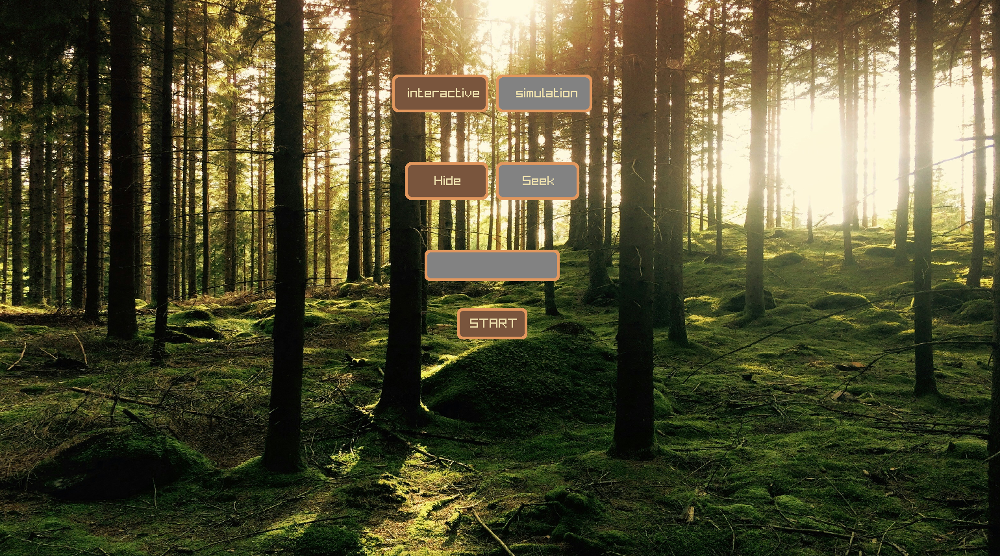
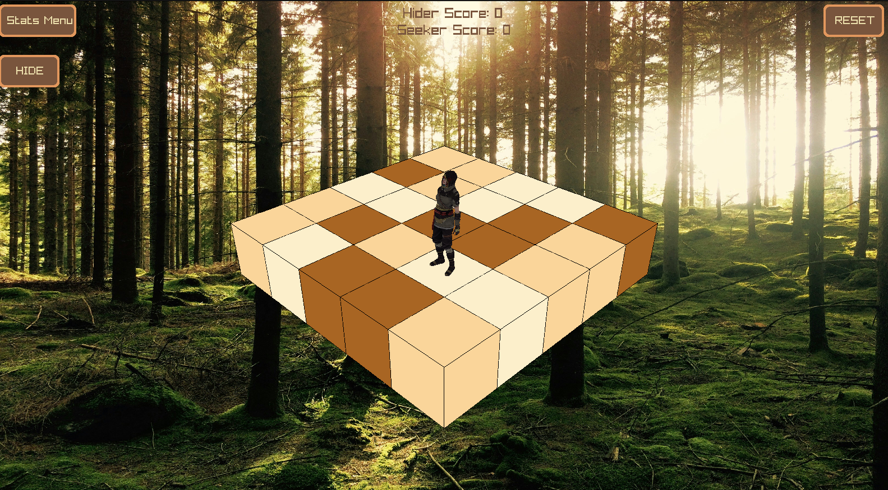
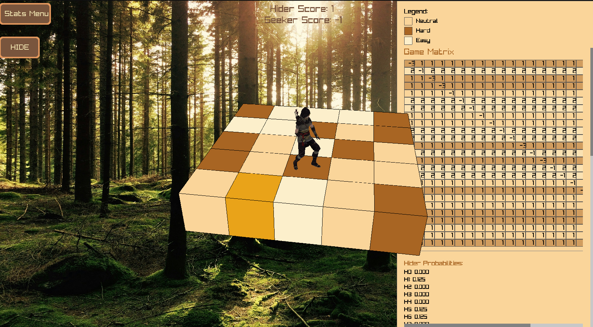

# Hide and Seek Game - Game Theory Visualizer

An interactive 3D game demonstrating Nash equilibrium and optimal mixed-strategy decision-making using the Simplex algorithm, featuring real-time AI visualization with smooth animations and adaptive UI.



## 📋 Table of Contents
- [Features](#features)
- [Screenshots](#screenshots)
- [Prerequisites](#prerequisites)
- [Installation](#installation)
- [How to Run](#how-to-run)
- [Gameplay](#gameplay)
- [Technical Details](#technical-details)
- [Project Structure](#project-structure)

## ✨ Features

- **🎮 Interactive 3D Gameplay**: Smooth skeletal animations with 5 character states (idle, running, hiding, winning, losing)
- **🤖 Optimal AI**: Implements Nash equilibrium using GLPK Simplex solver for mathematically proven optimal play
- **📊 Real-Time Visualization**: Dual-scrolling stats panel supporting up to 100×100 matrices with color-coded terrain indicators
- **📈 Simulation Mode**: Run 100-round simulations with detailed probability tracking and statistical analysis
- **🎯 Adaptive Terrain**: Dynamic difficulty system (easy, neutral, hard) with proximity-based scoring



## 🖼️ Screenshots

### Main Menu

*Choose between active play or simulation mode*


### Stats Panel

*Scrollable matrix view with live probability tracking*


## 🔧 Prerequisites


### Required Libraries

```bash
# Install Raylib
sudo apt-get install libraylib-dev

# Install GLPK (GNU Linear Programming Kit)
sudo apt-get install libglpk-dev

# Install Python and matplotlib (for statistics)
sudo apt-get install python3 python3-pip
pip3 install matplotlib

# Install additional dependencies
sudo apt-get install libgl1-mesa-dev libglu1-mesa-dev libx11-dev
```

## 📥 Installation

1. **Clone the repository**
```bash
git clone https://github.com/yourusername/hide-and-seek-game.git
cd hide-and-seek-game
```

2. **Verify dependencies**
```bash
# Check GCC version
gcc --version

# Check if Raylib is installed
pkg-config --modversion raylib

# Check if GLPK is installed
pkg-config --modversion glpk
```

## 🚀 How to Run

### Compile and Run (Single Command)
```bash
gcc main.c menu.c gui.c simulate.c solve.c -o hideseek \
    -lraylib -lm -lpthread -ldl -lrt -lGL -lX11 -lGLU -lglpk && ./hideseek
```

### Alternative: Using Makefile (Recommended)

Create a `Makefile`:
```makefile
CC = gcc
CFLAGS = -Wall -Wextra -O2
LIBS = -lraylib -lm -lpthread -ldl -lrt -lGL -lX11 -lGLU -lglpk
SRCS = main.c menu.c gui.c simulate.c solve.c
TARGET = hideseek

all: $(TARGET)

$(TARGET): $(SRCS)
	$(CC) $(CFLAGS) $(SRCS) -o $(TARGET) $(LIBS)

clean:
	rm -f $(TARGET)

run: $(TARGET)
	./$(TARGET)
```

Then run:
```bash
make run
```

## 🚀 Quick Start (One Command)

```bash
# Clone and run immediately
git clone https://github.com/yourusername/hide-and-seek-game.git
cd hide-and-seek-game
make

# Or use the quick-start script
chmod +x run.sh
./run.sh
```

## 📦 Makefile Commands

```bash
make           # Build and run immediately (default)
make run       # Run without rebuilding
make debug     # Build with debug symbols + start gdb
make quick     # Clean rebuild and run
make clean     # Remove build artifacts
make install   # Install system-wide (requires sudo)
make check     # Verify dependencies
make help      # Show all commands
make stats     # Show project statistics
make valgrind  # Check for memory leaks
make release   # Create release package
```

## 🎮 Gameplay

### Main Menu
1. **Choose World Size**: Select grid size (4, 9, 16, 25, 36, 49, 64, 81, or 100 cells)
2. **Select Mode**: 
   - **Hider**: You hide, AI seeks
   - **Seeker**: You seek, AI hides
3. **Play or Simulate**: Choose active play or run automatic 100-round simulation

### Active Play Controls
- **Mouse Click**: Select grid cell to move/hide
- **Arrow Keys**: Rotate camera (←/→) and adjust height (↑/↓)
- **Mouse Wheel**: Zoom in/out
- **H Key**: Quick hide (when in idle state)
- **Stats Menu Button**: View game matrix and probabilities
- **Reset Button**: Restart game with new scores

### Scoring System
- **Easy Terrain**: High reward when not caught (2-8 points)
- **Neutral Terrain**: Balanced risk/reward (2-4 points)
- **Hard Terrain**: High penalty if caught (-12 points)
- **Proximity Penalty**: 
  - 1 cell away: ×0.5 multiplier
  - 2 cells away: ×0.75 multiplier
  - 3+ cells away: ×1.0 multiplier

## 🔬 Technical Details

### Algorithms
- **Simplex Algorithm**: GLPK-based linear programming for Nash equilibrium
- **Fisher-Yates Shuffle**: Randomized terrain generation
- **Chebyshev Distance**: Proximity calculations (includes diagonals)
- **Ray Casting**: 3D object selection
- **Scissor-Mode Clipping**: Optimized scrollable UI rendering

### Architecture
```
main.c          - Entry point, game loop, audio management
menu.c          - Main menu UI and game setup
gui.c           - 3D gameplay, camera, animations, stats panel
simulate.c      - 100-round simulation with logging
solve.c         - Nash equilibrium solver, matrix generation
```

### Performance Optimizations
- **60 FPS cap** with frame-independent movement
- **Culled rendering** for off-screen elements
- **Efficient matrix storage** (sparse representation)
- **Lazy animation updates** (state-based)

## 📁 Organized Project Structure

```
hide-and-seek-game/
├── src/
│   ├── main.c                 # Entry point
│   ├── ai/
│   │   └── solve.c           # Nash equilibrium solver
│   ├── ui/
│   │   ├── menu.c            # Menu system
│   │   └── gui.c             # 3D gameplay UI
│   └── core/
│       └── simulate.c        # Simulation engine
├── include/
│   ├── solve.h
│   ├── menu.h
│   ├── gui.h
│   └── simulate.h
├── build/                     # Compiled objects (auto-generated)
├── resources/
│   ├── glbs/                 # 3D models
│   ├── music/                # Audio files
│   ├── images/               # Textures
│   └── fonts/                # Custom fonts
├── screenshots/              # Documentation images
├── docs/                     # Additional documentation
├── Makefile                  # Build configuration
├── run.sh                    # Quick-start script
├── organize.sh               # File organization script
└── README.md
```

## 🐛 Troubleshooting

### "cannot find -lraylib"
```bash
sudo apt-get install libraylib-dev
# OR build from source:
git clone https://github.com/raysan5/raylib.git
cd raylib/src
make PLATFORM=PLATFORM_DESKTOP
sudo make install
```

### "cannot find -lglpk"
```bash
sudo apt-get install libglpk-dev glpk-utils
```

### "Segmentation fault" on startup
- Ensure all `.glb` model files are in `resources/glbs/`
- Check that `resources/music/gameSong.mp3` exists
- Verify resource paths in code match your file structure

### Black screen or no rendering
- Update graphics drivers
- Check OpenGL version: `glxinfo | grep "OpenGL version"`
- Ensure Xorg is running (not Wayland)

## 🤝 Contributing

Contributions are welcome! Please feel free to submit a Pull Request.

## 📧 Contact

For questions or support, please open an issue on GitHub.
